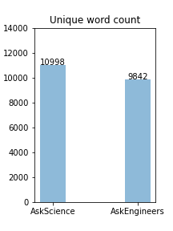
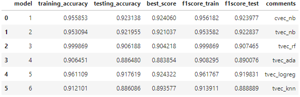
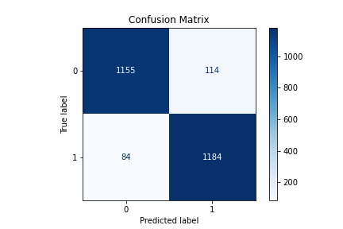
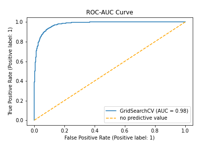

## Problem Statement

A university is organizing a panel discussion with experts in Science and Engineering. There are going to be live round of questions from in-person as well as remote audience during the panel discussion. There is going to be electronic entry of queries from remote audience as well as optionally from in-person audience. I have been tasked to create a model that can classify the electronically entered questions between the two categories (Science and Engineering) for the moderator so that the questions can be directed to appropriate experts for answering/discussion.

The aim of this project is to create a classification model for Science and Engineering categories that has a classifcation accuracy of more than 85% and an f1-score of more than 0.85. f1-score will be important to see here as we want both our classes classified as correctly as possible.

## Data Collection

In order to build a classification model, we need Science and Engineering text data (best if in the form of questions) to train the model. Two subreddits- AskScience and AskEngineers contains large amounts of data related to the two target categories. For this project, the data was collect from these two subreddits via the Reddit pushiftAPI.
In order to get as much text as possible, the subreddit submissions were filtered for the submissions that have both the title and the selftext(description/expansion of the title/question) during collection. A total of 5074 submissions were collected from each subreddit.
The submission data from both the subreddits are saved in the datasets folder.

## Data Cleaning and EDA

Initial exploratory analysis was done on the submissions before any cleaning.

### Text Length and Word Count Comparision  
  
The distributions for the length of the submission text (title and selftext) as well as number of words in the submissions were visualized. The figure below shows the distribution of number of words in AskScience and AskEngineers submission:

Figure 1

 

It is interesting to note from the above plot that there is much higher frequency for posts with more number of words for 'AskEngineers' subreddit. 
Total no. of Words for AskScience: 444254, Total no. of Words for AskEngineers: 662051. This indicates that we have more text from AskEngineer subreddit. This might be becaue Engineering posts may need more text in general to descirbe a question compared to Science posts.
The boxplots show some outliers in terms of the length of posts.

### No. of authors in each category   

There are almost equal number of authors in each subreddit (AskScience: 4433, AskEngineers: 4009) and there is no overlap of authors between the two subreddits.

### Subreddit submission activity

Subreddit submission activity like posts per hour, no. of comments etc. was anlayzed for both the subreddits. 
Some of the interesting observations from the statistical information are:    

**1.** The range of created UTC (max-min) for same no. of posts is small for AskEngineers subreddit compared to AskScience, indicating **more posts with selftext per hour for ASkEngineers compared to AskScience**. (This could also mean authors in AskScience dont like to write much self text in  their submissions.). Converting Epoch time range to hours, it appears that there is 1 post/hour with Selftext for AskEngineers whereas 1 post every 10hours for Ask Science.  
  
**2.** Average word count per post (including title and Selftext) is **88** for a submission in AskScience whereas it is **131** for AskEngineers.

**3.** Compairsion of number of comments for the two subreddits
From the statistical analysis it seems that average number of comments are much higher for AskScience (average:45, count ranging from 0 to 3395) posts compared to AskEngineers (average:0.01, count ranging from 0 to only 14). The figures below show the distributions for number of comments. 

Figure 2

 
 
This figure is zoomed in to visulaize the distribution for less than 100 comments better, actual distribution ranges from 0 to 3395.
 
Figure 3

 
 
The distribution plots shown above visually indicates that there are many more no. of comments for an Askscience submission compared to AskEngineers which might be because an answer to a science question is usually a discussion whereas answers to Engineering questions could be straight forward. This is an interesting insight for the panel discussion, as it indicates how the discussion on these two topics may go in real time as well. 
 
After this intial EDA, the text was analyzed. Looking at the text of several posts, there were noticable occurances of URLs, string patterns, new line, special characters etc. The data was cleaned to remove these. Also, float numbers, equations and dimensions are present in AskScience and AskEngineers submissions. In order to keep this information, these patterns were defined as 'floatnum','euqation' and 'dimension' etc. during the cleaning process. After cleaning the text, it was lemmatized and the stop words (words that are insignificant to the context like is, are etc.) were removed.
 
### EDA on Most Frequent Words  

There are about **28256** unique words in the whole dataset inclusing both the subreddits
The plots below show most frequent words for the two subreddits. AskScience has words like earth, light, energy as most frequent whereas Engineering has engineering, engineer, work, job, company etc. Both subreddits also have common words like 'like', use, know etc.

Figure 4

Figure 5

It is to be noted that overall the total word count for most frequent words is much higher in AskEngineers indicating again that there is much more text data for subreddit AskEngineers than AskScience. 

### Unique words in each subreddit  

Plot below shows count of unique words in each subreddit. It is to be noted that out of about 28,256 total words, **10,998 are unique to AskScience and 9842 are unique to AskEngineers**, and about 7416 are common.  

It is also to be noted that there was much more text (title and self-text) from AskEngineering compared to AskScience but we have more unique words for AskScience than AskEngineers. This maybe because Science in general contains different fields that include Biology, Physics, Chemistry, Astronomy and Earth Science etc. Engineering is more applied mathematics and science.

Figure 6

 
 
The list shown below contains the most frequent 20 unique words in the two subreddits. The words in AskScience are more medicine/biology related like vaccine, virus etc, whereas AskEngineers has wrds like civil,ee,units-mm etc.

From the exploratory data anlaysis, it seems like we have enough text from both the subreddits and enough unique words that we should be able to build a model to classify the two subreddits.

## Preprocessing and Modeling

The whole dataset containing text from both the subreddits was split into train and test dataset with equal split of both the subreddits. 
Both the train and test text data was cleaned for the URLs, special characters etc. and substitues were made for special patterns like equation etc. After this, the data was lemmatized and the stop words were removed.
The training data was used to train the model. With the goal of a good classification model, several different modeling techniques were attempted including Naive Bayes, Random Forest, AdaBoost, Logistic Regression and K-nearest neighbors. The models were evaluated in terms of accuracy and f1-scores.
Below is a summary of the model evaluation metrics:

Considering f1-score as our final evaluation metrics, summary of model performance:

1. Naive Bayes with cvec: high testing score: 0.92 with a difference between training and testing score of about 0.032 
2. Naive Bayes with Tfidf: very comparable to Naive Bayes with cvec, testing score: 0.92 with a train and test difference of 0.031
3. Random Forest: very overfit model with 0.99 training score and 0.9 testing score
4. Logistic Regression: high training score: 0.96 but lower testing score: 0.92 compared to Naive Bayes, slightly more overfit than Naive Bayes
5. Ada Boost: Not overfit (difference between training and testing score is 0.01) but low scores (training: 0.91, testing: 0.89)
6. K-nearest neighbors: Less overfit (difference between training and testing score is 0.02) but lower testing score compared to Naive Bayes (0.89) 

All the models except for Random Forest are very close to each other in performance. Naive Bayes with Tfidf (Model 2) has the highest accuracy score (0.92(92%)) and f1 score (training: 0.95, testing: 0.92) along with being one of the less overfit models.  
This model meets our criteria (>85% accuracy and f1-score) and is one of the best performing models so it will be selected as production model.

## Production Model and further evaluation

The production model was further evaluated to understand the accuracy and misclassification.
The figure below shows the confusion matrix giving percentage of true and false, positives and negatives. 

Figure 8

Specificity: 0.91
Recall score/Sensitivity: 0.93
Precision score: 0.91
Balanced accuracy: 0.92

The model is predicitng 91% of 0s (AskEngineers) correctly and 93% of 1s (AskScience) correctly and has 7.8% misclassification. 
It has more false positives (114) than false negatives (184), and higher sensitivity meaning that it is more inclined to give false positives and predict a query/submission belonging to class- AskScience (value 1).
The Balanced accuracy is 0.92 which gives good confidence in calssification accuracy for both the classes.
The ROC AUC curve shown below indicates that we have good separation of the two classes.

Figure 9

**Feature importance insight**  
To gain an insight on what features are important for classification, Model 4 Logistic Regression, which was close to our production model in performance, was used to look at top 5 significant words. Words like earth, human, electron, animal, happen are significant for classificaiton of a post in AskScience whereas words like engineer, design, company, job, want are significant for classification as AskEngineers. 

### Misclassification EDA  

About 7.8% submissions (198/2537) were misclassified in the test set. 
On looking at the text of some misclassified posts, it appears that a lot of posts that are getting misclassified have physics or engineering related text. Since Physics is a branch of science, and is the foundation of Engineering there is an overlap of text which is making it difficult to correclty classify. Also sometime, the author may have asked 'engineering' query in the AskScience forum.

## Conclusion and Recommendations

We have successfully trained a model to classify between the Science and Engineering queries using the data from two subreddits- AskScience and AskEngineers. 
This production model has testing accuracy of 92% and testing f1-score of 0.92 which meets our criteria for acceptable model. It also has a balanced accuracy score of 0.92 which indicates good classificaiton accuracy for both the classes. 
This model will be recommended to the University to use during their panel discussion to classify the questions in two categories-Science and Engineering.

## Next Steps

The model has good f1 score and balanced accuracy but it still has false positives and false negatives. Since this model needs accuracy for both the classes, it would be good to tune the model to reduce both false positives and false negatives.
An initial look at the misclassifed posts shows that there are some more generalized words like-like, use, know that occur frequently in both the categories. Next steps could be to remove these common words and thus make the text more unique and see if it helps with the classification.

